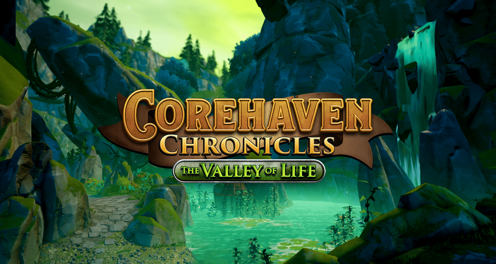

# Corehaven Chronicles

A new passage has opened to the mythical Valley of Life! See for yourself what wonders it holds, and see if you can claim the treasures that lie within.

Join up with your friends to conquer the second chapter of Corehaven Chronicles: The Valley of Life. You'll need might, magic, tactics and a bit of luck in order to defeat all the bosses. Along the way you'll collect and upgrade epic gear, and challenge the progressively harder and harder difficulty levels: Normal, Hard, Nightmare and Infinite Difficulty.

## Disclaimer

This project is being released as-is and targetted towards more advanced users. It does not reflect current best practices nor is it perfectly optimized, please keep that in mind.

## Project Structure

Corehaven Chronicles consists of 3 games, each of those are in their respective top level folder of the project:

- DungeonHubWorld, the main game.
- Dungeon_01
- Dungeon_02

## Feedback & Support

Please use GitHub issues for feedback and support.

## Contributing

If you are interested in fixing issues and contributing directly to the code base, please see our [contributing guidelines](CONTRIBUTING.md).

## License

Licensed under the [Apache License 2.0](LICENSE) license.
